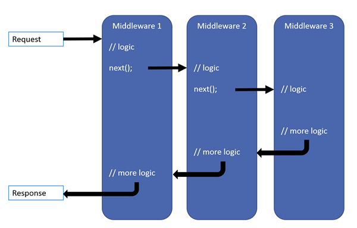
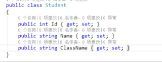
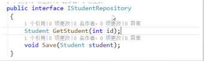
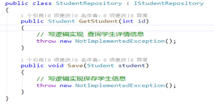
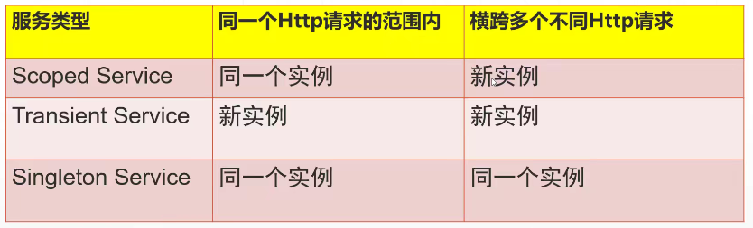

## 简介

.NET Framework类库,是微软.NET下提供的一个底层类库，封装了很多类供我们开发。 代码运行在CLR（公共运行平台）。

问题：

1.CLR和windows系统结合是非常好。在windows平台下都很流畅。

2.VisalStido开源, Framework只能运行在window操作系统。


随着微软拥抱开源，微软开发了一套全新的框架库，就是.NET Core。

.NET Core是全部纯新的一套框架库,支持跨平台，所有操作系统。


 

建议：ASP.NET FW 和ASP.NET CORE如何选择，如果项目是新项目并且对操作系统移植有要求，推荐使用ASP.NET CORE3.X。


FW下有很多框架：ASP.NET WebForm, ASP.NET MVC, ASP.NET WebAPI, 窗体应用程序winform

Core                    ：ASP.NET Core WebForm   ASP.NET Core MVC  ASP.NET Core WebApi


## 项目结构

> appsettings.json

配置网站信息，例如ConnnectionStrings

> Program

主入口程序，类似Global中的Application_Start

```csharp
public static void Main(string[] args)
{
    CreateHostBuilder(args).Build().Run();
}

public static IHostBuilder CreateHostBuilder(string[] args) =>
    Host.CreateDefaultBuilder(args)
    .ConfigureWebHostDefaults(webBuilder =>
   {
      //中间件，注册Startup配置类
      webBuilder.UseStartup<Startup>();
   });
```

> Startup

用户的注册服务，在该文件中，我们可以以注入的方式来进行相关功能的添加


Core支持程序的热加载

快捷键ctrl+F5，笔记本有Fn 需要Fn+Ctrl+F5


## 中间件(Middleware)

中间件是组装到应用程序管道中以处理请求和响应的软件。 每个组件：

- 选择是否将请求传递给管道中的下一个组件。
- 可以在调用管道中的下一个组件之前和之后执行工作。

请求委托（Request delegates）用于构建请求管道，处理每个HTTP请求。

请求委托使用`Run`，`Map`和`Use`扩展方法进行配置。单独的请求委托可以以内联匿名方法（称为内联中间件）指定，或者可以在可重用的类中定义它。这些可重用的类和内联匿名方法是中间件或中间件组件。请求流程中的每个中间件组件都负责调用流水线中的下一个组件，如果适当，则负责链接短路。


ASP.NET Core请求流程由一系列请求委托组成，如图所示



每个委托可以在下一个委托之前和之后执行操作。委托还可以决定不将请求传递给下一个委托，这称为请求管道的短路。短路通常是可取的，因为它避免了不必要的工作。例如，静态文件中间件可以返回一个静态文件的请求，并使管道的其余部分短路。需要在管道早期调用异常处理委托，因此它们可以捕获后面管道的异常。

示例：

> 中间件使用

```csharp
app.Run(async context =>
{
	await context.Response.WriteAsync("method1");
});
```

> 中间件短路

```csharp
app.Run(async context =>
{
	await context.Response.WriteAsync("method1");
});
app.Run(async context =>
{
	await context.Response.WriteAsync("method2");
});
//试一试结果是什么
```

使用app.Use中间件

```csharp
app.Use(async (context,next) =>
{
     await context.Response.WriteAsync("method1");
     await next.Invoke();
});
app.Run(async context =>
{
    await context.Response.WriteAsync("method2");
});
```


## 常用中间件

IConfiguration：配置文件

ConfigureServices服务类中间件

```csharp
//注入EF SQL服务
services.AddDbContextPool<AppDbContext>(options =>
{
  options.UseSqlServer(_configuration.GetConnectionString("StudentDBConnection"));
});
//mvc中间件
services.AddMvc(options => options.EnableEndpointRouting = false);
//IOC容器中间件
services.addTransient<IStudentRepository, SQLStudentRepository>();
services.AddScoped<IStudentRepository, SQLStudentRepository>();
services.AddSingleton<IClassesRepository, SQLClassesRepository>();
//中文编码中间件
services.AddControllers().AddJsonOptions(options =>
{
  options.JsonSerializerOptions.Encoder=JavaScriptEncoder.Create(UnicodeRanges.All);
});
```

Configure服务中，具体配置的中间件

```csharp
//开发模式中间件
if (env.IsDevelopment())
{
    app.UseDeveloperExceptionPage();
}
//静态资源加载中间件
app.UseStaticFiles();
app.UseDefaultFiles();
//使用mvc和默认路由中间件
app.UseMvc(routers => {
    routers.MapRoute("default", "{controller=Home}/{action=List}/{id?}");
});
```


## 加载静态资源

```csharp
app.UseStaticFiles();
```


## 设置初始页

```csharp
FileServerOptions options = new FileServerOptions();
options.DefaultFilesOptions.DefaultFileNames.Clear();
options.DefaultFilesOptions.DefaultFileNames.Add("index.html");
app.UseFileServer(options);
```


## 再聊MVC

关于Model：通常来说，我们的Model在开发时使用的是ORM，我们可以简单理解为在MVC中的Model负责的是数据的读写和实体类的创建。

在DDD（领域驱动设计中），我们将将Model细分整合后合成为了一个叫做Domain（领域）

Domain：领域，他的作用是用来存放领域实体、存储、领域服务用的。

Domain包括4个部分：

**Entities:实体**



**Policies：接口**



**Repositories:存储库**



**Services:领域服务**


## ASP.NET Core MVC使用

步骤1：在注入服务中添加MVC组件中间件

```csharp
public void ConfigureServices(IServiceCollection services)
{
    //MVC中间件
    services.AddMvc(options => options.EnableEndpointRouting = false);\
}
```

步骤2：配置MVC路由中间件

```csharp
app.UseMvc(routers => {
    routers.MapRoute("default", "{controller=Home}/{action=List}/{id?}");
});
```


## ViewStart和ViewImport

ViewStart：用户设置母版页,可以让页面继承母版页后省略Layout下的路径填写

ViewImport:用于统一设置强类型页面中类型的命名空间


## LibMan使用

客户端（前端）库管理工具，类似npm，微软最新推出的。


nuget安装后端插件.dll


## ASP.NET Core自带的IOC容器

IServiceCollection下有三个自带IOC容器可以让我们使用他们分别是：

AddSingleton:首次请求会创建一个服务，然后后续请求使用的都是**相同实例**，整个应用程序声明周期中使用该单个实例。

AddScoped:在范围内**每个请求**创建一个服务实例，例如在web应用程序中，他为每个http请求创建一个实例，但是同一个web请求中的其他服务在请求的时候，都会使用相同的实例。

AddTransient:**每次**请求时，都创建一个**新的服务实例**。





## TagHelper

服务器端的组件，可以在Razor文件中创建和渲染HTML元素

TagHelper类似于HTML TagHelper

内置的TagHelper用于常见任务，例如生成连接，创建表单，加载数据


使用步骤：

导入

```
//_ViewImports.cshtml
@addTagHelper *,Microsoft.AspNetCore.Mvc.TagHelpers
```


语法参考：https://blog.csdn.net/Cheng_XZ/article/details/112894788


**使用TagHelper的优势**

 TagHelper是根据应用程序的路由模板生成的链接，这意味着如果我们更改路由模板，则TagHelper生成的链接会针对路由模板所做的更改自动修改和适配，让生成的链接正常工作。


## 使用ORM

core中使用EntityFramework

步骤：

一、安装Microsoft.EntityFrameworkCore.SqlServer -Version 5.0.10

```
Install-Package Microsoft.EntityFrameworkCore.SqlServer -Version 5.0.10
```

参考：Core ORM全驱动下载地址

https://docs.microsoft.com/zh-cn/ef/core/providers/?tabs=dotnet-core-cli

二、创建DbContext文件

```csharp
public class AppDbContext:DbContext
{
    //要将应用程序配置信息传递给DbContext，需要对DbContextOptions进行实例化
    public AppDbContext(DbContextOptions<AppDbContext> options):base(options)
    {

    }
    public DbSet<Student> Students { get; set; }
}
```

三、Startup中进行服务注入

```csharp
//注入sqlserver服务
services.AddDbContextPool<AppDbContext>(options =>
{
                                            options.UseSqlServer(_configuration.GetConnectionString("connString"));

});
```


## 数据迁移

数据迁移是为了让我们数据库架构设计与应用程序的模型类（实体类）保持同步的功能。


**切记：先安装Install-Package Microsoft.EntityFrameworkCore.Tools**


迁移命令

```
//提供ef core的帮助信息
get-help about_entiryframeworkcore
```

```
//添加新迁移记录
add-migration
add-migration initialmigration
```

```
//将数据库更新为指定的迁移
update-database
```


## 种子数据

初始化

```csharp
protected override void OnModelCreating(ModelBuilder modelBuilder)
{
    modelBuilder.Entity<Student>().HasData(
        new Student
        {
            Id = 1,
            Name = "张三",
            ClassId = 1,
            Emali = "30856896@qq.com",
            Phone = "13803797005"
        },
        new Student
        {
            Id = 2,
            Name = "王五",
            ClassId = 1,
            Emali = "872330790@qq.com",
            Phone = "13803797005"
        }

    ); ;
}
```

## Session

步骤：

使用IDistributedcache接口服务启用内存缓存

```csharp
services.AddDistributedMemoryCache();
```

调用addsession方法

```csharp
services.AddSession();
```

使用usesession回调(需在useMvc()方法前调用)

```csharp
app.UseSession();
//中间件：配置mvc中的路由
app.UseMvc(routers => {
    routers.MapRoute("default", "{controller=Student}/{action=List}/{id?}");
});
```


## 日志记录nlog

完整需要对程序的请求过程进行日志记录，常用的日志记录库非常多，例如NLog、Stackdriver、Gelf、Log4net、Logger等。

日志记录主要对项目的异常和请求进行捕获记录。

以nlog使用步骤为例：

安装插件

一、通过nuget安装NLog.Web.AspNETCore

二、添加配置文件,配置文件内容

注意：设置文件属性为“始终复制”


## Filter拦截器

## Authonization Filter

**权限控制过滤器**
通过 Authonization Filter 可以实现复杂的`权限角色认证`、`登陆授权`等操作

```csharp
public class AuthonizationFilter :Attribute,IAuthorizationFilter
    {
        public void OnAuthorization(AuthorizationFilterContext context)
        {
            //这里可以做复杂的权限控制操作
            if (context.HttpContext.User.Identity.Name != "1") //简单的做一个示范
            {
                //未通过验证则跳转到无权限提示页
                RedirectToActionResult content = new RedirectToActionResult("NoAuth", "Exception", null);
                context.Result = content;
            }
        }
    }
```

**Resource Filter资源过滤器**
可以通过Resource Filter 进行`资源缓存`、`防盗链`等操作。
使用Resource Filter 要求实现IResourceFilter 抽象接口

```csharp
public class ResourceFilter : Attribute,IResourceFilter
    {
        public void OnResourceExecuted(ResourceExecutedContext context)
        {
            // 执行完后的操作
        }

        public void OnResourceExecuting(ResourceExecutingContext context)
        {
            // 执行中的过滤器管道
        }
    }
```

**Exception Filter** 

通过Execption Filter 过滤器可以进行全局的`异常日志收集` 等操作。

使用Execption Filter 要求实现`IExceptionFilter` 抽象接口
`IExceptionFilter`接口会要求实现`OnException`方法，当系统发生未捕获异常时就会触发这个方法。`OnException`方法有一个`ExceptionContext`异常上下文，其中包含了具体的异常信息，HttpContext及mvc路由信息。系统一旦出现未捕获异常后，比较常见的做法就是使用日志工具，将异常的详细信息记录下来，方便修正调试。下面是日志记录的实现。　

```csharp
public class ExecptionFilter : Attribute, IExceptionFilter
  {
        private ILogger<ExecptionFilter> _logger;
        //构造注入日志组件
        public ExecptionFilter(ILogger<ExecptionFilter> logger)
        {
            _logger = logger;
        }

        public void OnException(ExceptionContext context)
        {
            //日志收集
            _logger.LogError(context.Exception, context?.Exception?.Message??"异常");
        }
    }
```

　**Action Filter,ResultFilter**


**过滤器注册方式**

一、Action

二、Controller

三、全局注册方式

```csharp
public void ConfigureServices(IServiceCollection services)
{
    //全局注册异常过滤器
    services.AddControllersWithViews(option=> {
        option.Filters.Add<ExecptionFilter>();
    });

    services.AddSingleton<ISingletonService, SingletonService>();
}
```

四、 TypeFilter和ServiceFilter

```csharp
public class ExecptionFilter : Attribute, IExceptionFilter
    {
        private ILogger<ExecptionFilter> _logger;
        //构造注入日志组件
        public ExecptionFilter(ILogger<ExecptionFilter> logger)
        {
            _logger = logger;
        }

        public void OnException(ExceptionContext context)
        {
            //日志收集
            _logger.LogError(context.Exception, context?.Exception?.Message??"异常");
        }
    }
```

从上面的代码中可以发现 ExceptionFilter 过滤器实现中存在日志服务的构造函数的注入，也就是说该过滤器依赖于其他的日志服务，但是日志服务都是通过DI 注入进来的；再来回顾下上面Action 注册方式或者Controller 注册方式 也即`Attribute` 特性标注注册方式，本身基础的特性是不支持构造函数的，是在运行时注册进来的，那要解决这种本身需要对服务依赖的过滤器需要使用 `TypeFilter` 或者`ServiceFilter` 方式进行过滤器的标注注册。

`TypeFilter` 和`ServiceFilter` 的区别。

- ServiceFilter和TypeFilter都实现了IFilterFactory
- ServiceFilter需要对自定义的Filter进行注册，TypeFilter不需要
- ServiceFilter的Filter生命周期源自于您如何注册，而TypeFilter每次都会创建一个新的实例

**TypeFilter 使用方式**

```csharp
[TypeFilter(typeof(ExecptionFilter))]
public IActionFilter Index2()
{
      return View();
}
```

**ServiceFilter**

```csharp
[ServiceFilter(typeof(ExecptionFilter))]
public IActionFilter Index2()
{
           return View();
}
```

服务注册代码

```csharp
public void ConfigureServices(IServiceCollection services)
{
        //注册过滤器服务，使用ServiceFilter 方式必须要注册 否则会报没有注册该服务的相关异常
        services.AddSingleton<ExecptionFilter>();
}
```

